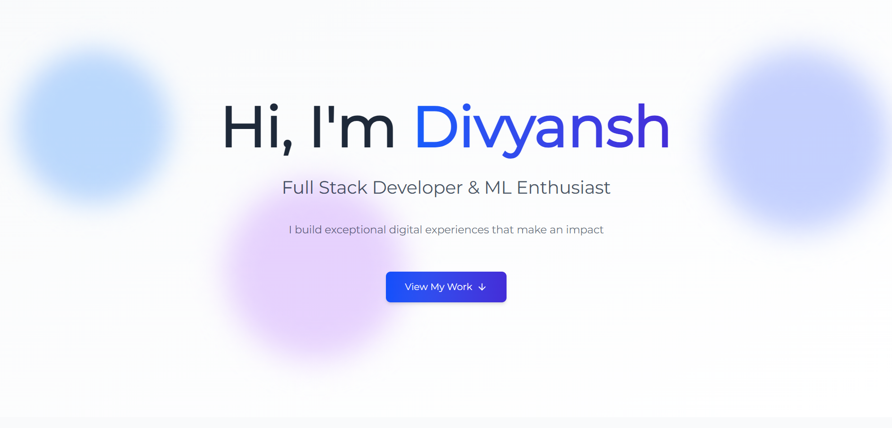
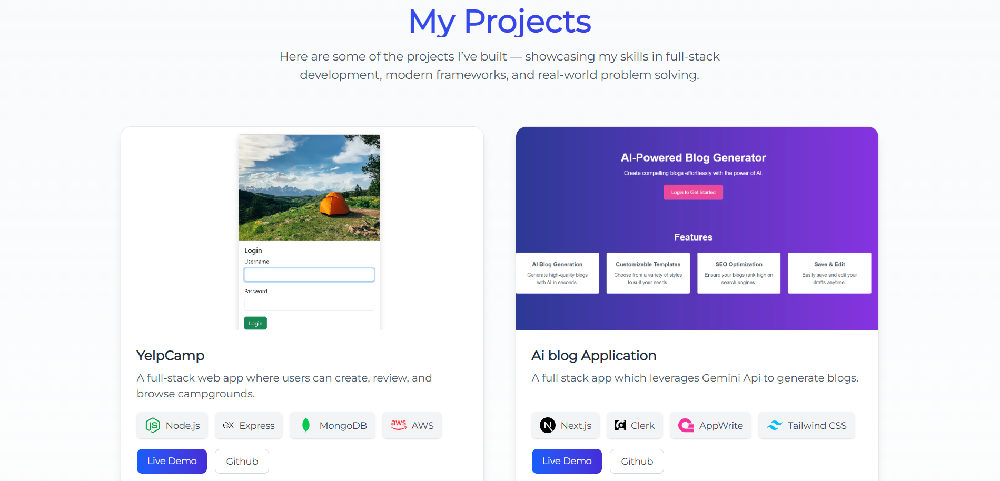

# 🚀 My Developer Portfolio

Welcome to my personal portfolio website!  
This project showcases my skills, projects, and professional background, built with **Next.js**, **TypeScript**, **Tailwind CSS**, and **Framer Motion**.

---

## 🌐 Live Demo

👉 [View Portfolio](https://portfolio-eight-sigma-31.vercel.app)

---

## 🛠 Tech Stack

- **Next.js** — React framework with optimized routing & SSR  
- **TypeScript** — Static typing for scalability  
- **Tailwind CSS** — Utility-first CSS for fast styling  
- **Framer Motion** — Smooth animations & transitions  
- **React Icons** — Icons for tech stack & social links  
- **EmailJS** — Contact form functionality  
- **Vercel** — Hosting & deployment  

---

## ✨ Features

- 🎨 **Modern Hero Section** — Animated intro with a clean layout  
- 💼 **Projects Showcase** — Cards displaying title, description, tech stack & links  
- 📩 **Contact Form** — Integrated with EmailJS for direct messaging  
- 📱 **Responsive Design** — Optimized for all screen sizes  
- ⚡ **Smooth Animations** — Page transitions with Framer Motion  
- 🧭 **Navbar Navigation** — Smooth scroll to different sections  

---

## 📸 Screenshots


```markdown




🚀 Getting Started
Prerequisites

Node.js (v14+ recommended)

npm, yarn, or pnpm

Installation

Clone the repository:
